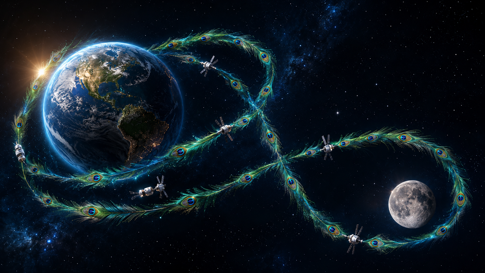
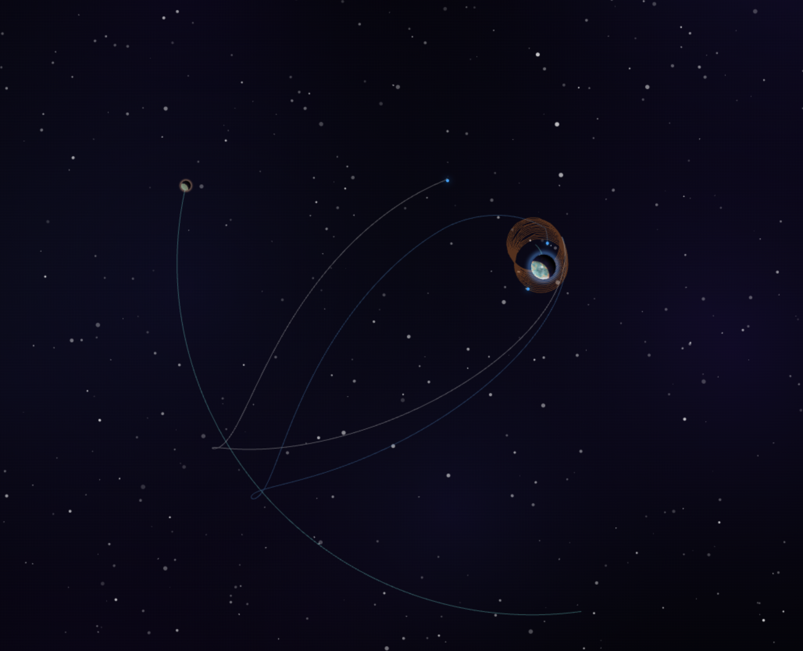

# NebulaSim

### Le simulateur orbital cinématique qui fait décoller vos missions.

[**Lancer l'application →**](https://nebula-orbit.puter.site/)

---

## Mission Brief 02 · Artemis II Multi-Étages

> *« La fusée qui se débarrasse d'elle-même. »*

Le préréglage **Artemis II Multi-Stage** reconstitue, à l'échelle du simulateur, la mission lunaire la plus ambitieuse de la décennie — **SLS + ICPS + Orion**, trois véhicules empilés, deux séparations autonomes, un atterrissage propulsif en cinq actes.

Du décollage de Cap Canaveral jusqu'au baiser final sur le sol terrestre, **52 manœuvres scénarisées** orchestrent un ballet orbital fidèle au profil réel d'Artemis II — survol lunaire en trajectoire de retour libre compris.

### Ce que vous allez voir

| Acte | Ce qui se passe à l'écran |
|---|---|
| **01 · Décollage SLS** | Le cœur orange et ses deux propulseurs solides arrachent l'empilement à la gravité terrestre. |
| **02 · Largage du premier étage** | Le SLS se détache en débris orbital. L'ICPS prend le relais — 354 × moins de poussée, infiniment plus de finesse. |
| **03 · HEO + Injection Trans-Lunaire** | Boucle de vérification en orbite haute, puis l'ICPS pousse Orion vers la Lune. |
| **04 · Largage de l'ICPS** | Second jettison. Orion file en solo vers son survol lunaire. |
| **05 · Survol de la Lune** | Trajectoire de retour libre — pas d'insertion, juste une caresse gravitationnelle. |
| **06 · Atterrissage propulsif** | Désorbitage, chute libre tour-haute, *suicide burn* au ralenti, *kiss landing*. Le moment SpaceX, en cinq actes ralentis à 0,25×. |

### Le détail qui change tout : la manœuvre `stage`

Pour rendre la séparation **autonome** (et pas seulement déclenchée à la main), un nouveau type de manœuvre a été ajouté au moteur de vol. Le pilote automatique sait désormais lâcher ses étages tout seul — au bon moment, dans la bonne attitude, sans toucher au clavier.

> **Une mission, trois fusées, zéro intervention.** Vous lancez. La fusée fait le reste.

---

## Essayer le préréglage

### Option 1 — En ligne (recommandé)

1. Ouvrez **[nebula-orbit.puter.site](https://nebula-orbit.puter.site/)**
2. Le préréglage **Artemis II Multi-Stage** est chargé au démarrage
3. Appuyez sur lecture · regardez décoller

### Option 2 — Télécharger le préréglage

[**⬇ Télécharger `1ArtemisMultiStage.json`**](https://github.com/TheSamLePirate/NebulaSim/releases/latest/download/1ArtemisMultiStage.json)

Puis, dans l'application, importez le fichier via le menu *Charger un préréglage*.

---

## En savoir plus

📄 **[Lire le Mission Brief 02 (FR)](importAtStartup/docWeb/artemis2-multistage.fr.html)** — l'architecture étage par étage, les masses simulées, la chorégraphie de l'atterrissage, le tableau de correspondance mission réelle ↔ simulation.

📄 **[Read the Mission Brief 02 (EN)](importAtStartup/docWeb/artemis2-multistage.html)**

---

*NebulaSim · Mission Brief 02 · Rev 1972.05*
**3 étages · 2 séparations autonomes · 1 atterrissage cinématique.**

